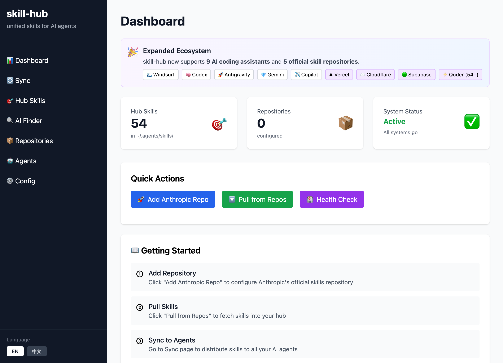

# skill-hub

Unified skill management system for AI coding agents (Antigravity, Claude, Codex, Copilot, Cursor, Gemini CLI, OpenCode, Qoder, Windsurf).

English | [简体中文](README.zh-CN.md)

> 🎉 **NEW in v0.2.0**: Support for `.agents/skills/` standard directory - a unified, agent-agnostic location for project-specific skills. [Learn more](#shared-skills-directory-agentsskills)



*Modern web interface showing the dashboard with `.agents/skills/` standard support, quick actions, and getting started guide.*

## Overview

skill-hub discovers, synchronizes, and distributes AI coding agent skills across multiple platforms. It provides a centralized repository at `~/.agents/skills/` and ensures all agents have access to the same skill definitions.

### Problem

AI coding agents each maintain their own skill definitions in separate configuration directories, leading to:
- **Duplication**: Same skills stored multiple times across different agent configs
- **Inconsistency**: Skills drift out of sync when updated in one location
- **Discovery friction**: No centralized view of available skills across all agents
- **Manual overhead**: Developers must manually copy skills between agents

### Solution

skill-hub solves these problems by:
1. **Discovering** skills from all agent configuration directories
2. **Synchronizing** them to a central hub at `~/.agents/skills/`
3. **Distributing** updated skills back to all agent configurations

## Features

- 🔍 **Multi-Agent Discovery**: Automatically find skills from 9+ AI coding assistants
- 🔄 **Bi-Directional Sync**: Pull skills from agents to hub, push from hub to agents
- 🎯 **Shared Skills Standard**: Support for `.agents/skills/` directory for agent-agnostic project skills
- ⚡ **Incremental Updates**: Only sync changed skills for better performance
- 🔧 **Extensible**: Plugin architecture for easy addition of new agents
- 🏥 **Health Checks**: Verify adapter configurations, permissions, and shared skills detection
- 📊 **Rich CLI**: Beautiful terminal output with tables and progress indicators
- 🌐 **Web Interface**: Modern FastAPI + HTMX + Tailwind CSS web UI with real-time updates
- 📦 **Remote Repositories**: Pull skills from official and community repositories
- 👁️ **Skill Preview**: View skill details with markdown rendering in the browser

## Installation

### From Source

```bash
# Clone the repository
git clone https://github.com/yourusername/skill-hub.git
cd skill-hub

# Install in development mode
pip install -e ".[dev]"
```

### From PyPI (coming soon)

```bash
pip install skill-hub
```

## Quick Start

### 1. Discover Skills

Find all skills across your AI agent configurations:

```bash
skill-hub discover
```

This will scan:
- `.agents/skills/` (shared, agent-agnostic - **NEW in v0.2.0**)
- `~/.antigravity/skills/`, `.agent/skills/` (Antigravity)
- `~/.claude/skills/`, `.claude/skills/` (Claude)
- `~/.codex/skills/`, `.codex/skills/` (Codex)
- `~/.copilot/skills/`, `.github/skills/` (GitHub Copilot)
- `~/.cursor/skills/`, `.cursor/skills/` (Cursor)
- `~/.gemini/skills/`, `.gemini/skills/` (Gemini CLI)
- `~/.config/opencode/skills/`, `.opencode/skills/` (OpenCode)
- `~/.qoder/skills/`, `.qoder/skills/` (Qoder)
- `~/.codeium/windsurf/skills/`, `.windsurf/skills/` (Windsurf)

### 2. Sync Skills

Synchronize skills between hub and agents:

```bash
# Bi-directional sync (pull then push)
skill-hub sync

# Only pull from agents to hub
skill-hub sync --pull

# Only push from hub to agents
skill-hub sync --push
```

### 3. List Skills in Hub

```bash
skill-hub list
```

### 4. Check Agent Health

```bash
skill-hub agents --check
```

### 5. Add Remote Repositories

Pull skills from official repositories:

```bash
# Quick setup with all official repositories
skill-hub init --with-all

# Or add individually
skill-hub init --with-anthropic      # Claude, general AI skills
skill-hub init --with-vercel         # React, Next.js, web design
skill-hub init --with-cloudflare     # Workers, Durable Objects
skill-hub init --with-supabase       # PostgreSQL best practices

# Add custom repositories
skill-hub repo add https://github.com/yourorg/skills

# Pull skills from all configured repositories
skill-hub pull

# List configured repositories
skill-hub repo list
```

**Official Skill Repositories:**
- **Anthropic**: https://github.com/anthropics/skills
- **Vercel Labs**: https://github.com/vercel-labs/agent-skills
- **Cloudflare**: https://github.com/cloudflare/skills
- **Supabase**: https://github.com/supabase/agent-skills
- **Qoder Community**: https://github.com/Qoder-AI/qoder-community (54+ skills, 9 categories)

### 6. Web Interface

Launch a browser-based UI to manage skills (opens automatically in your default browser):

```bash
# Start FastAPI Web UI (default) - auto-opens browser
skill-hub web

# Choose a different backend
skill-hub web --backend streamlit
skill-hub web --backend flask

# Start without opening browser
skill-hub web --no-browser
```

#### Web Interface Screenshots

**Dashboard - Quick Actions & Getting Started**


*Dashboard showing skill count, repositories, quick actions, and getting started guide with the new `.agents/skills/` standard.*

**Skill Preview - Markdown Rendering**


*Skill preview page showing markdown-rendered skill content with metadata, license, and compatibility information. Click any skill name in Hub Skills or AI Skill Finder to preview.*

<!-- Additional screenshots coming soon:
- Agents page with health check and shared skills detection
- Skills hub central repository view
- Sync operations with three modes
-->

The web interface provides:
- 📊 Dashboard with quick actions and metrics
- 🔄 Sync controls (pull/push/both)
- 📦 Repository management (add/list/pull)
- 🤖 Agent health checks with shared skills detection
- ⚙️ Configuration viewer
- 🔍 Skill discovery
- 👁️ Skill preview with markdown rendering

## Setup for New Users

When someone clones this project repository, they need to set up their **local user configuration**:

### Initial Setup

1. **Install the project:**
   ```bash
   git clone https://github.com/yourusername/skill-hub.git
   cd skill-hub
   pip install -e .
   ```

2. **Initialize configuration:**
   
   **Option A: Quick setup with all official repositories (recommended)**
   ```bash
   skill-hub init --with-all
   ```
   
   **Option B: Quick setup with Anthropic only**
   ```bash
   skill-hub init --with-anthropic
   ```
   
   **Option C: Interactive setup**
   ```bash
   skill-hub init
   # Follow the prompts to select repositories
   ```
   
   **Option D: Custom repositories**
   ```bash
   skill-hub init --repo https://github.com/yourorg/team-skills
   ```

3. **Pull skills:**
   ```bash
   skill-hub pull
   ```

4. **Distribute to your agents:**
   ```bash
   skill-hub sync
   ```

### Configuration Storage

**Important:** Configuration is stored **per-user** at `~/.agents/skills/.skill-hub/config.json`, NOT in the project repository. This means:

- ✅ Each user configures their own repositories
- ✅ Each user manages their own hub at `~/.agents/skills/`
- ✅ Configuration is **not** checked into Git
- ✅ Team members can share skill repository URLs via documentation

### Sharing Repository Configuration

To help team members, you can document recommended repositories in your project:

**Option 1: Simple one-liner in your project README**
```markdown
## Setup Skills

After installation, run:
```bash
skill-hub init --with-anthropic --repo https://github.com/yourorg/team-skills
skill-hub pull
```
```

**Option 2: Shell script** (`setup-skills.sh`):
```bash
#!/bin/bash
set -e

echo "Setting up skill-hub..."
skill-hub init --with-anthropic --repo https://github.com/yourorg/team-skills

echo "Fetching skills..."
skill-hub pull

echo "Distributing to agents..."
skill-hub sync

echo "✓ Skills setup complete!"
```
```

### Private Repositories

For private GitHub repositories, set an environment variable:

```bash
export SKILL_HUB_GITHUB_TOKEN="ghp_your_token_here"
skill-hub pull
```

Add to your shell profile (`~/.zshrc`, `~/.bashrc`) to persist across sessions.

## Supported Agents

| Agent | Project-Local | Global | Status |
|-------|--------------|--------|--------|
| **Antigravity** | `.agent/skills/` | `~/.antigravity/skills/` | ✅ v0.2.0 |
| **Claude** | `.claude/skills/` | `~/.claude/skills/` | ✅ v0.1.0 |
| **Codex** | `.codex/skills/` | `~/.codex/skills/` | ✅ v0.2.0 |
| **GitHub Copilot** | `.github/skills/` | `~/.copilot/skills/` | ✅ v0.2.0 |
| **Cursor** | `.cursor/skills/` | `~/.cursor/skills/` | ✅ v0.1.0 |
| **Gemini CLI** | `.gemini/skills/` | `~/.gemini/skills/` | ✅ v0.2.0 |
| **OpenCode** | `.opencode/skills/` | `~/.config/opencode/skills/` | ✅ v0.1.0 |
| **Qoder** | `.qoder/skills/` | `~/.qoder/skills/` | ✅ v0.1.0 |
| **Windsurf** | `.windsurf/skills/` | `~/.codeium/windsurf/skills/` | ✅ v0.2.0 |

## Shared Skills Directory (`.agents/skills/`)

### Overview

As of version 0.2.0, skill-hub supports the **`.agents/skills/` standard** - a unified, agent-agnostic directory for sharing skills across all AI coding agents in a project.

### Why Use `.agents/skills/`?

**Benefits:**
- ✅ **Single source of truth**: One directory for all agents in a project
- ✅ **Simplified onboarding**: New team members only need to know about one location
- ✅ **Agent-agnostic**: Skills work across all AI coding agents without duplication
- ✅ **Better IDE integration**: Standard location for tooling to discover skills
- ✅ **Team collaboration**: Easy to version control and share via Git

**When to use:**
- Project-specific skills that should be available to all team members
- Skills that are specific to your codebase or workflow
- Skills you want to track in version control (add `.agents/` to your repo)

**When to use agent-specific directories:**
- Personal preferences and workflow customizations
- Skills specific to one AI agent's capabilities
- Global skills installed system-wide

### Directory Structure

```
my-project/
├── .agents/               # Shared agent configuration (NEW)
│   └── skills/           # Shared skills for all agents
│       ├── code-review/
│       │   └── SKILL.md
│       └── deploy-prod/
│           └── SKILL.md
├── .cursor/              # Cursor-specific (optional)
│   └── skills/
├── .claude/              # Claude-specific (optional)
│   └── skills/
├── .git/
└── src/
```

### Discovery Priority

When the same skill exists in multiple locations, skill-hub uses this priority order:

1. **`.agents/skills/`** (highest priority - shared)
2. **`.cursor/skills/`, `.claude/skills/`, etc.** (agent-specific project-local)
3. **`~/.cursor/skills/`, `~/.claude/skills/`, etc.** (global)

**Example:** If `git-release` skill exists in both `.agents/skills/` and `.cursor/skills/`, skill-hub will:
- Discover both versions
- Tag them with source ("shared" vs "cursor")
- Report a conflict if content differs
- Use existing conflict resolution strategy (newest, manual, etc.)

### Usage

#### 1. Create Shared Skills Directory

```bash
# In your project root (where .git/ is)
mkdir -p .agents/skills
```

#### 2. Add Skills

```bash
# Create a skill in the shared directory
mkdir .agents/skills/my-skill
cat > .agents/skills/my-skill/SKILL.md << 'EOF'
---
name: my-skill
description: Project-specific skill for the team
---

## What I do
Help with project-specific tasks.

## When to use me
When working on this codebase.
EOF
```

#### 3. Discover and Sync

```bash
# Discover skills (includes .agents/skills/)
skill-hub discover

# Sync to hub and distribute to all agents
skill-hub sync
```

#### 4. Check Health Status

```bash
skill-hub agents --check
```

Output will show shared skills status:
```
┌─────────┬─────────┬─────────────────────────────┬────────┐
│ Agent   │ Enabled │ Global Path                 │ Status │
├─────────┼─────────┼─────────────────────────────┼────────┤
│ cursor  │ ✓       │ ~/.cursor/skills            │ OK     │
│ shared  │ ✓       │ /project/.agents/skills     │ OK     │
└─────────┴─────────┴─────────────────────────────┴────────┘
```

### Version Control

You can commit `.agents/skills/` to your repository to share with your team:

```bash
# Add to Git
git add .agents/
git commit -m "Add shared project skills"
git push
```

**Team members will automatically discover these skills** when they run `skill-hub discover` or `skill-hub sync` in the project directory.

### Migration from Agent-Specific Directories

To migrate existing skills to the shared directory:

```bash
# Option 1: Manual copy
mkdir -p .agents/skills
cp -r .cursor/skills/my-skill .agents/skills/

# Option 2: Use skill-hub sync
# 1. Pull skills to hub
skill-hub sync --pull

# 2. Copy from hub to .agents/skills/
cp -r ~/.agents/skills/my-skill .agents/skills/

# 3. Sync back to all agents
skill-hub sync --push
```

### Backward Compatibility

The `.agents/skills/` standard is **fully backward compatible**:
- Existing projects without `.agents/skills/` work exactly as before
- Agent-specific directories (`.cursor/skills/`, etc.) continue to work
- No configuration changes required
- Skills from all locations are discovered and synchronized

## Skill Format

Skills must be defined in `SKILL.md` files with YAML frontmatter:

```markdown
---
name: git-release
description: Create consistent releases and changelogs
license: MIT
compatibility: cursor, claude, qoder, opencode
---

## What I do
- Draft release notes from merged PRs
- Propose a version bump
- Provide a copy-pasteable `gh release create` command

## When to use me
Use this when you are preparing a tagged release.
```

### Requirements

- **name**: Lowercase alphanumeric with single hyphens (1-64 chars)
- **description**: 1-1024 characters
- **license**: Optional license identifier
- **compatibility**: Optional compatibility note
- **metadata**: Optional key-value pairs

## CLI Commands

### `skill-hub web`

Start the web interface for managing skills through a browser. The browser will open automatically.

```bash
skill-hub web                           # Start FastAPI UI (default, port 8501, auto-open browser)
skill-hub web --backend fastapi         # Explicit FastAPI backend with HTMX + Tailwind
skill-hub web --backend streamlit       # Use Streamlit backend
skill-hub web --backend flask           # Use Flask backend (Vue.js + Element Plus)
skill-hub web --host 0.0.0.0 --port 8080  # Custom host/port
skill-hub web --no-browser              # Start without opening browser
```

**Features:**
- **Dashboard**: Quick init, pull, health check, and metrics with `.agents/skills/` standard info
- **Sync**: Bi-directional, pull-only, or push-only sync with real-time results
- **Hub Skills**: View all skills in central hub with descriptions and discovery sources
- **AI Skill Finder**: AI-powered semantic search to find relevant skills
- **Skill Preview**: Click any skill name to view full content with markdown rendering
- **Repositories**: Add/list/remove remote repos, pull skills from GitHub
- **Agents**: List adapters and run health checks with shared skills detection
- **Config**: View current configuration JSON
- **Discovery**: Discover skills from all agents including shared directory

**Backends:**
- **FastAPI** (default): Modern, fast async backend with HTMX + Tailwind CSS, SPA-like experience
- **Streamlit**: Interactive Python-native UI with automatic reload
- **Flask**: Lightweight REST API with Vue.js + Element Plus frontend

### `skill-hub init`

Initialize skill-hub configuration with repository setup.

```bash
skill-hub init                      # Interactive mode with prompts
skill-hub init --with-all           # Add all official repositories
skill-hub init --with-anthropic     # Add Anthropic skills only
skill-hub init --with-vercel        # Add Vercel Labs skills only
skill-hub init --with-cloudflare    # Add Cloudflare skills only
skill-hub init --with-supabase      # Add Supabase skills only
skill-hub init --with-qoder         # Add Qoder Community skills only
skill-hub init --repo <url>         # Add custom repository
skill-hub init --with-all --repo https://github.com/org/repo  # Combine options
```

**Interactive Mode Example:**
```
$ skill-hub init
Initializing skill-hub configuration...

Quick Setup:

Add official skills repositories? [Y/n]: y

Select repositories to add:
  • Anthropic (Claude, general AI skills) [Y/n]: y
    ✓ Added: https://github.com/anthropics/skills
  • Vercel Labs (React, Next.js, web design) [y/N]: y
    ✓ Added: https://github.com/vercel-labs/agent-skills
  • Cloudflare (Workers, Durable Objects, web perf) [y/N]: n
  • Supabase (PostgreSQL best practices) [y/N]: n

Add custom repository? [y/N]: y
  Repository URL: https://github.com/myorg/skills
    ✓ Added
  Add another? [y/N]: n

✓ Configuration saved to ~/.agents/skills/.skill-hub/config.json
  3 repository(ies) configured

Next steps:
  1. Run: skill-hub pull to fetch skills
  2. Run: skill-hub sync to distribute to agents
```

### `skill-hub sync`

Synchronize skills between hub and agents.

```bash
skill-hub sync              # Bi-directional (pull then push)
skill-hub sync --pull       # Pull from agents to hub
skill-hub sync --push       # Push from hub to agents
skill-hub sync --verbose    # Show detailed logging
```

### `skill-hub discover`

Discover skills from all agent configurations.

```bash
skill-hub discover          # Show skills in table format
skill-hub discover --json   # Export as JSON
```

### `skill-hub list`

List all skills in the central hub.

```bash
skill-hub list
```

### `skill-hub agents`

Manage agent adapters.

```bash
skill-hub agents            # List all adapters
skill-hub agents --check    # Run health checks
```

### `skill-hub repo`

Manage remote skill repositories.

```bash
skill-hub repo add <url>           # Add a repository
skill-hub repo add <url> --branch dev --path /skills  # With options
skill-hub repo list                # List configured repositories
skill-hub repo remove <url>        # Remove a repository
```

**Examples:**
```bash
# Add official repositories
skill-hub repo add https://github.com/anthropics/skills
skill-hub repo add https://github.com/vercel-labs/agent-skills
skill-hub repo add https://github.com/cloudflare/skills
skill-hub repo add https://github.com/supabase/agent-skills
skill-hub repo add https://github.com/Qoder-AI/qoder-community --path src/content/skills

# Add with specific branch
skill-hub repo add https://github.com/yourorg/skills --branch develop

# Add with subdirectory path
skill-hub repo add https://github.com/example/repo --path /contrib/skills
```

### `skill-hub pull`

Pull skills from remote repositories.

```bash
skill-hub pull                      # Pull from all enabled repositories
skill-hub pull <url>                # Pull from specific repository
```

**What it does:**
1. Clones or updates repositories (shallow clone with `--depth 1`)
2. Scans for `SKILL.md` files
3. Imports skills to `~/.agents/skills/`
4. Tracks commit hashes for incremental updates
5. Saves metadata (sync count, last sync time, imported skills)

## Architecture

```
skill-hub/
├── src/skill_hub/
│   ├── adapters/          # Agent-specific adapters
│   │   ├── antigravity.py  # Google Antigravity
│   │   ├── claude.py       # Anthropic Claude
│   │   ├── codex.py        # OpenAI Codex
│   │   ├── copilot.py      # GitHub Copilot
│   │   ├── cursor.py       # Cursor IDE
│   │   ├── gemini.py       # Gemini CLI
│   │   ├── opencode.py     # OpenCode
│   │   ├── qoder.py        # Qoder
│   │   └── windsurf.py     # Windsurf
│   ├── discovery/         # Skill discovery engine
│   ├── sync/              # Synchronization engine
│   ├── remote/            # Remote repository management
│   ├── utils/             # Utilities (YAML parser, validators)
│   ├── web/               # Web interfaces
│   │   ├── app.py         # Flask app (REST API + Vue UI)
│   │   └── streamlit_app.py  # Streamlit app
│   ├── models.py          # Data models
│   └── cli.py             # Command-line interface
├── tests/                 # Unit and integration tests
└── openspec/              # OpenSpec specifications
```

## Development

### Setup Development Environment

```bash
# Install with development dependencies
pip install -e ".[dev]"

# Run tests
pytest

# Run tests with coverage
pytest --cov=skill_hub --cov-report=term-missing

# Format code
black src/ tests/

# Lint code
ruff check src/ tests/

# Type check
mypy src/
```

### Running Tests

```bash
# Run all tests
pytest

# Run specific test file
pytest tests/unit/test_utils.py

# Run with verbose output
pytest -v

# Run with coverage
pytest --cov=skill_hub
```

## Configuration

skill-hub uses a configuration file at `~/.agents/skills/.skill-hub/config.json`:

```json
{
  "version": "1.0.0",
  "conflict_resolution": "newest",
  "agents": {
    "cursor": {
      "enabled": true,
      "global_path": null
    },
    "claude": {
      "enabled": true,
      "global_path": null
    },
    "qoder": {
      "enabled": false,
      "global_path": null
    },
    "opencode": {
      "enabled": true,
      "global_path": null
    }
  },
  "sync": {
    "incremental": true,
    "check_permissions": true,
    "create_directories": true
  }
}
```

## Roadmap

### Phase 1 (Completed - v0.1.0)
- ✅ Multi-agent skill discovery
- ✅ Bi-directional synchronization
- ✅ Support for 4 AI coding assistants (Cursor, Claude, Qoder, OpenCode)
- ✅ Basic conflict detection
- ✅ Remote repository support (pull from GitHub, etc.)
- ✅ Configuration management system
- ✅ Web interface foundations

### Phase 2 (Completed - v0.2.0)
- ✅ Expanded ecosystem support (9+ agents: Antigravity, Claude, Codex, Copilot, Cursor, Gemini CLI, OpenCode, Qoder, Windsurf)
- ✅ Shared `.agents/skills/` directory standard
- ✅ Unified hub location (`~/.agents/skills/`)
- ✅ Repository metadata tracking
- ✅ Enhanced web interface (FastAPI + HTMX + Tailwind CSS, Streamlit, Flask)
- ✅ Auto-open browser on web command
- ✅ Official repository integrations (Anthropic, Vercel Labs, Cloudflare, Supabase, Qoder Community)
- ✅ Internationalization (i18n) support for English and Chinese

### Phase 3 (Future)
- 🔲 File watching for automatic sync
- 🔲 Cloud sync between machines
- 🔲 Skill validation and testing
- 🔲 Advanced conflict resolution strategies
- 🔲 Skill marketplace/registry

## Contributing

Contributions are welcome! Please read the [Contributing Guidelines](CONTRIBUTING.md) before submitting PRs.

### Adding a New Agent

To add support for a new AI coding agent:

1. Create a new adapter in `src/skill_hub/adapters/`:

```python
from skill_hub.adapters.base import AgentAdapter

class NewAgentAdapter(AgentAdapter):
    @property
    def name(self) -> str:
        return "newagent"

    @property
    def default_global_path(self) -> str:
        return "~/.newagent"

    @property
    def project_local_dirname(self) -> str:
        return ".newagent"
```

2. Register it in `AdapterRegistry`
3. Add tests
4. Update documentation

## License

MIT License - see [LICENSE](LICENSE) for details.

## Acknowledgments

- Built with [OpenSpec](https://github.com/Fission-AI/OpenSpec) for specification-driven development
- Skill format inspired by [OpenCode Skills](https://opencode.ai/docs/skills/)
- CLI built with [Click](https://click.palletsprojects.com/) and [Rich](https://rich.readthedocs.io/)

## Support

- **Issues**: [GitHub Issues](https://github.com/yourusername/skill-hub/issues)
- **Discussions**: [GitHub Discussions](https://github.com/yourusername/skill-hub/discussions)
- **Documentation**: [Full Documentation](https://skill-hub.readthedocs.io/)
