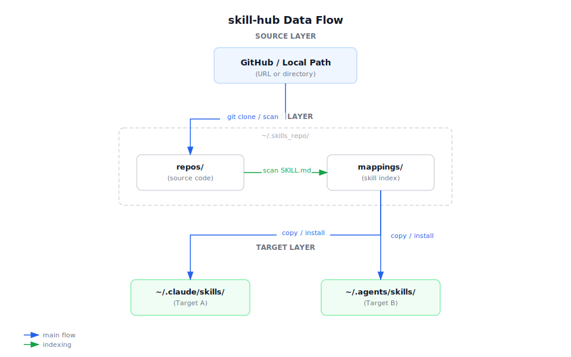

# skill-hub

<p align="center"></p>

**[English](./README.md)** | **[中文](./README.zh-CN.md)**

Web UI for managing skills from GitHub repositories and local directories — with a focus on **reducing unnecessary token overhead**.

## Why skill-hub?

Managing agent skills shouldn't waste tokens. skill-hub centralizes skill discovery, installation, and versioning so you spend less time describing what skills do and more time using them.

- **One source of truth** — skills live in `~/.skills_repo/`, not scattered across chat histories
- **Visual discovery** — browse skill metadata in the Web UI instead of reading full SKILL.md files through your agent
- **Sync-once, use-everywhere** — install to `~/.claude/skills/` and `~/.agents/skills/` in one click, avoiding repeated "please install this skill" conversations
- **Version awareness** — yellow dots tell you when a skill is outdated, preventing stale instructions from silently consuming tokens
- **Install only what you need** — keep your global skill space lean. Install project-specific skills to `.agents/skills/` (private) and only widely-used skills to `~/.agents/skills/` (global). The fewer irrelevant skills in scope, the less token waste on false-positive matches

## Architecture

### Data Flow

<p align="center"></p>

### Module Structure

```
src/skill_hub/
├── cli.py              # Click CLI entrypoint (web, version, self-update)
├── models.py           # SkillMetadata dataclass
├── version.py          # Version parsing and GitHub release checking
├── utils/
│   ├── __init__.py     # Path helpers (expand_path, derive_name)
│   └── yaml_parser.py  # SKILL.md YAML frontmatter parser
└── web/
    ├── app.py          # Flask app factory
    ├── api.py          # REST API routes
    ├── repos.py        # Repo management (clone, scan, install)
    ├── state.py        # Installed skills state tracking
    └── templates/
        └── index.html  # Single-page web UI
```

## Installation

```bash
pip install skill-hub

# Or from GitHub
pip install git+https://github.com/wuerping/skill-hub.git

# Development
pip install -e .
```

## Quick Start

```bash
# Start the web UI
skill-hub web

# Check version
skill-hub version

# Update to the latest version
skill-hub self-update
```

The web UI opens at `http://127.0.0.1:7860` where you can add GitHub repos or local directories, browse skills, and install them to `~/.claude/skills/` and `~/.agents/skills/`.

```bash
# Custom port
skill-hub web --port 8080

# Don't auto-open browser
skill-hub web --no-open

# Check for updates without installing
skill-hub version --check
```

## CLI Commands

| Command | Description |
|---------|-------------|
| `skill-hub web` | Start the web UI |
| `skill-hub version` | Show current version |
| `skill-hub version --check` | Check if a newer version is available |
| `skill-hub self-update` | Upgrade skill-hub via pip |

## How It Works

1. **Add a GitHub repo or local directory** via the UI — remote repos get cloned into `~/.skills_repo/repos/`, local paths are scanned in place
2. **Skills are discovered** automatically via `SKILL.md` files in the repo
3. **Install skills** to `~/.claude/skills/` and `~/.agents/skills/` with one click
4. **Sync status** — green dots mean installed version matches source, yellow means outdated
5. **Repo sync** — detect and pull remote updates, with a sync status indicator per repo (local paths skip cloning)

## Features

- Skills grouped by repository (remote and local)
- Per-directory install status (green = up-to-date, yellow = outdated vs source)
- Install to both `~/.claude/skills` and `~/.agents/skills` simultaneously
- Click yellow dots to reinstall a single directory from source
- Click skill names to view metadata from `SKILL.md` frontmatter
- Add/remove repos, with remote update detection
- **Local directory support** — add any local path (e.g. `~/code/my-skills`) as a skill source
- **Default repository** — `anthropics/skills` is automatically added on first run
- **Repository diagnostics** — 🔍 button runs comprehensive health checks (git, network, SKILL.md files, mappings)

## SKILL.md Format

```markdown
---
name: skill-name
description: A brief description of the skill
license: MIT
compatibility: cursor, claude, opencode
metadata:
  version: 1.0.0
  author: you@example.com
---

## Skill Content

Your skill instructions here...
```

## Directory Structure

```
~/.skills_repo/
├── repos.yaml             # repo list config
├── repos/                 # cloned git repos
│   └── owner__repo/
│       └── ...
└── mappings/              # skill location mappings (YAML)
    └── owner__repo.yaml

~/.claude/skills/          # installed skills (target A)
~/.agents/skills/          # installed skills (target B)
```

## License

MIT
